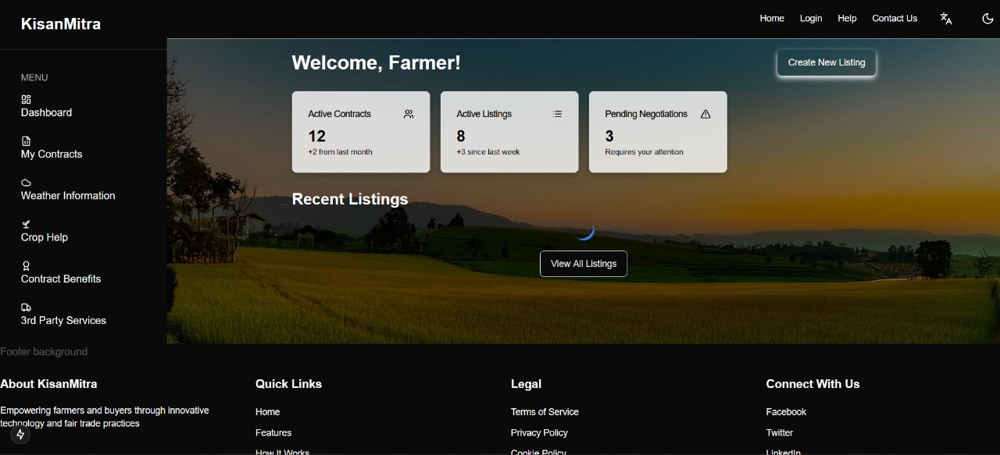
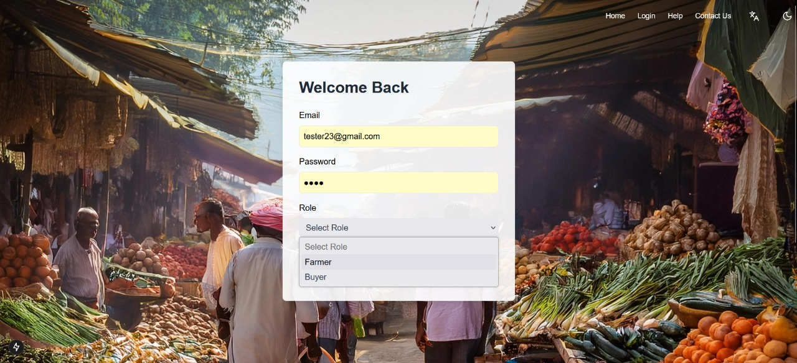

# KisanMitra

[Live Demo](https://kisanmitra-tau.vercel.app/)

KisanMitra is a smart contract-based farming platform that bridges the gap between farmers and buyers. The platform enables secure, transparent, and efficient transactions by allowing users to negotiate, compare pricing, and form contracts before cropping. This ensures profitable outcomes for both parties involved.

## 📌 Features
- **Role-Based System:** Seamless registration for Farmers and Buyers.
- **Smart Contract Integration:** Secure and transparent contract formation.
- **Negotiation System:** Efficient negotiation process for better pricing.
- **Pricing Comparison:** Compare prices to get the best deals.
- **User Authentication:** Secure login and registration.
- **State Selection:** Users can select their state for regional relevance.

## 💻 Technologies Used
- **Frontend:** Next.js, Tailwind CSS
- **Backend:** Node.js, Express.js, MongoDB
- **Blockchain:** Smart Contracts (for transaction security)
- **Authentication:** JWT-based Authentication
- **Deployment:** Vercel (Frontend), Render (Backend)

📷 Screenshots

Screenshots are saved in the previewimages folder of the public directory. Below are the available screenshots:





## 🔧 Installation & Setup
1. **Clone the repository**
```bash
https://github.com/your-username/kisanmitra.git
```
2. **Navigate to the project directory**
```bash
cd kisanmitra
```
3. **Install dependencies**
```bash
npm install
```
4. **Configure environment variables**
Create a `.env` file in the root directory and add your environment variables as shown below:
```
MONGODB_URI=your_mongodb_connection_string
JWT_SECRET=your_jwt_secret
```
5. **Run the application**
```bash
npm run dev
```
The application will start at `http://localhost:3000`

## 📌 Usage
- Farmers can register and create contracts for their crops.
- Buyers can view the contracts, compare prices, and negotiate with farmers.
- Both parties can agree on a contract before cropping to ensure profits.

## 🚀 Deployment
- The frontend is deployed on **Vercel**.
- The backend is deployed on **Render**.

## 🤝 Contributing
Contributions are welcome! Please fork this repository and submit a pull request for review.

## 📜 License
This project is licensed under the MIT License.

## 📧 Contact
If you have any questions or suggestions, feel free to reach out at `guptasameer533@gmail.com`.

